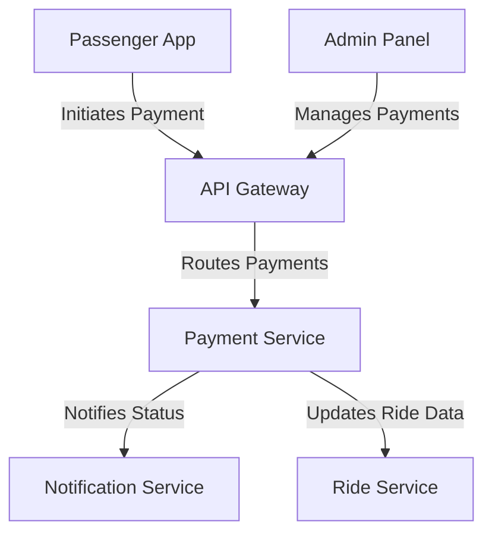

# Payment Service

The Payment Service is a microservice in the ride-booking system responsible for handling financial transactions, integrating with payment gateways, and generating receipts.

## Key Features
- **Transaction Processing**: Manages secure payments via multiple methods (cards, wallets).
- **Receipt Generation**: Creates detailed billing summaries post-ride.
- **Refund Handling**: Processes refunds or adjustments as needed.

## Architecture Diagram

## Interaction with Other Services
The Payment Service ensures smooth financial operations by interacting with:
- **API Gateway**: Receives payment requests from the Passenger App or Admin Panel for processing.
- **Ride Service**: Updates ride records with payment status (e.g., paid, pending) after transactions.
- **Notification Service**: Sends payment confirmation or failure alerts to passengers and drivers.
- **Admin Panel**: Allows oversight of transactions, refunds, and driver payroll through routed requests.

